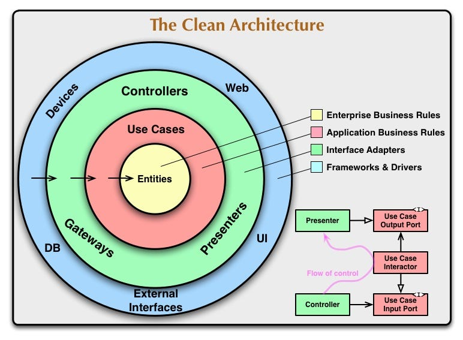

# Clean Architecture Project

  

   
  

## Table of Contents

- [Overview](#overview)
- [Tests](#tests)
- [Project Structure](#project-structure)
- [Technologies Used](#technologies-used)
- [Author](#-author)

## Overview

This project embraces the principles of Clean Architecture, **focusing on entities and use cases**. It is designed with modularity and maintainability in mind, making it easy to extend and adapt to changing requirements.

Please note that the second part of this project, which includes controllers, database interactions, etc., is being developed in a separate repository using Nest.js. You can find it [**here**](https://github.com/GianDutra/Forum-with-Nest-and-Clean-Architect).

## Tests

This project includes a comprehensive suite of unit tests to ensure the correctness and reliability of the codebase. Tests are located in the `test` directory.

## Project Structure

The project is organized according to the principles of Clean Architecture, separating concerns into layers:

- **Core**: Contains the fundamental building blocks of the application.
  - **Entities**: Define the core data structures of the application.
  - **Errors**: Houses custom error types for the application.
  - **Events**: Manages domain events and event handling.
  - **Repositories**: Specifies interfaces for data access.
  - **Types**: Provides utility types.
- **Domain**: Contains the application-specific logic.
  - **Forum**: Handles forum-related functionality.
    - **Application**: Contains use cases.
    - **Entities**: Define entities specific to the forum.
- **Enterprise**: Contains business-specific logic.
  - **Entities**: Define entities specific to the business domain.
  - **Value Objects**: Define value objects used in the business logic.

## Technologies Used

- **[NodeJS](https://nodejs.org)**
- **[Fastify](https://github.com/fastify/fastify)**
- **[Fastify/JWT](https://github.com/fastify/fastify-jwt)**
- **[Fastify/cookie](https://github.com/fastify/fastify-cookie)**
- **[Prisma](https://www.prisma.io/)**
- **[Bcryptjs](https://github.com/dcodeIO/bcrypt.js)**
- **[Supertest](https://github.com/visionmedia/supertest)**
- **[Tsup](https://github.com/effector/tsup)**
- **[Vitest](https://github.com/vitejs/vite)**
- **[Dayjs](https://github.com/iamkun/dayjs)**
- **[Zod](https://github.com/vriad/zod)**
- **[PostgreSQL](https://www.postgresql.org/)**

## 👨‍💼 Author

<table>
  <tr>
    <td align="center">
      <a href="#">
         
        
          <b>Gian Dutra</b>
        
      </a>
    </td>
  </tr>
</table>

